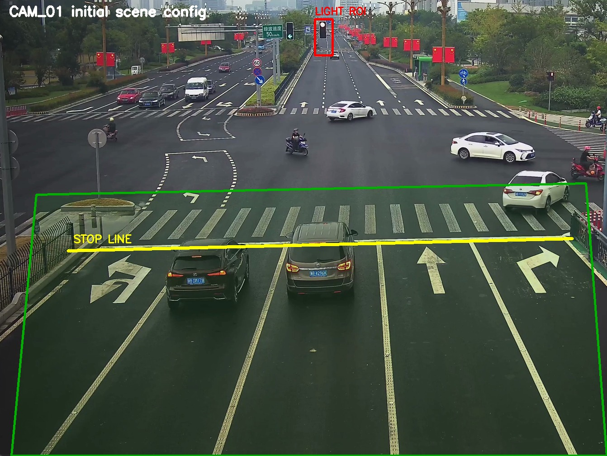
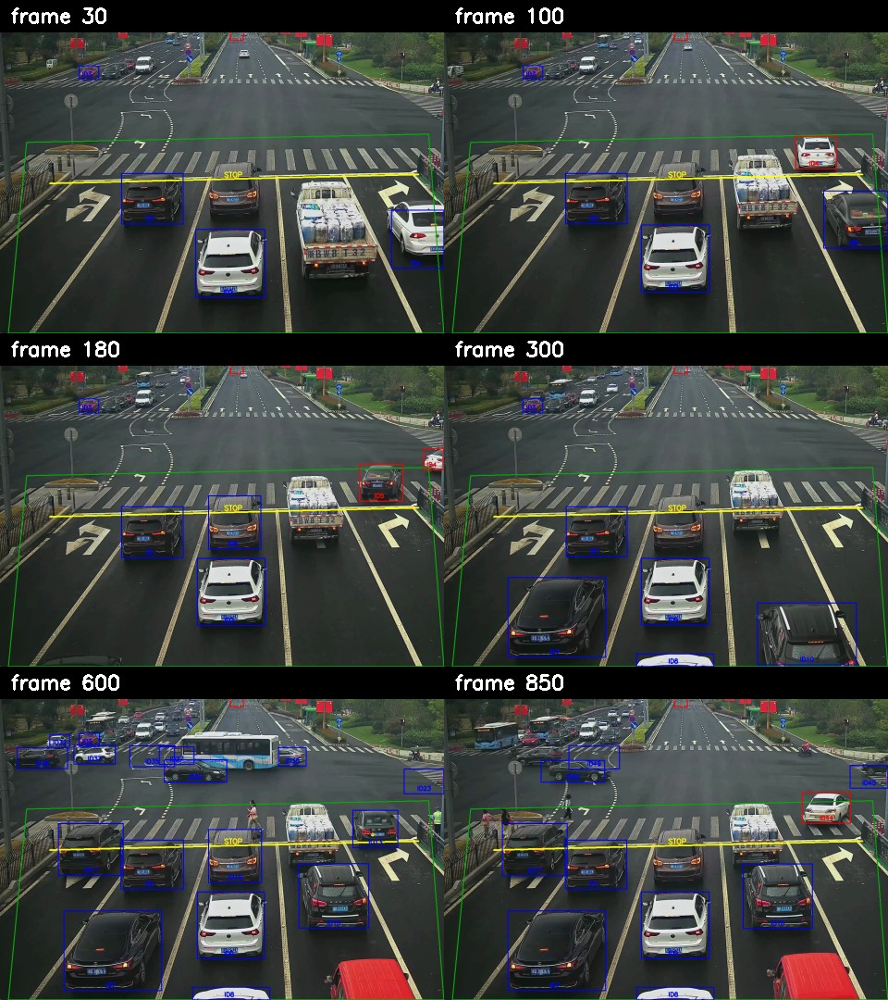
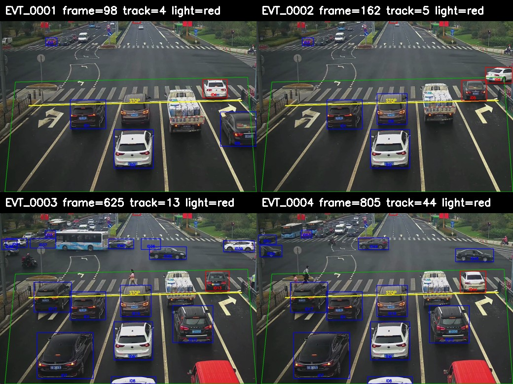
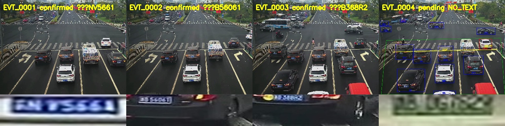
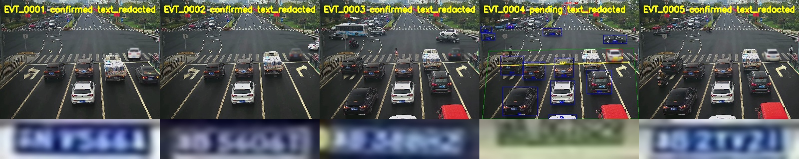

# Traffic Violation Detection & License Plate Recognition

Fixed-camera traffic video pipeline for detecting red-light/stop-line violations, reading license plates, and saving evidence.

## MVP Scope

- One fixed traffic camera scene.
- Offline daytime video.
- Cars only for the first MVP.
- Rule-based traffic light state from ROI + HSV.
- Stop-line crossing from tracked vehicle movement.
- Evidence saved as image/JSON first; clip output can be added after baseline.

## Current Status

Layer 5 event review is complete on `cam_01_clip_001.mp4` under the configured stop-line rule.

| Layer | Status | Notes |
|---|---|---|
| Layer 1 — Data preparation | Done | Raw videos converted to 60s clips, reference frames, overlay images, inventory JSON |
| Layer 2 — Detection/tracking/scene logic | Baseline done | YOLO + IoU tracker fallback debug run on CAM_01 |
| Layer 3 — Violation baseline | Baseline reviewed | Pending events saved with snapshots and reviewed under the configured stop-line rule |
| Layer 4 — Plate OCR/evidence | Improved baseline done | Fine-tuned YOLO plate detector + HyperLPR evidence run produced 5 event candidates, 5 plate crops, 4 OCR texts |
| Layer 5 — Evaluation/polish | Event review done | Candidate precision is reviewed under the configured stop-line rule; plate accuracy waits for readable plate ground truth |

## Layer 1 Outputs

Raw videos are stored locally under `data/raw_videos/` and are ignored by Git.



*CAM_01 scene overlay: dashed line = stop line, box = traffic light ROI.*

Generated Layer 1 files:

```text
data/raw_videos/clips/cam_01_clip_001.mp4
data/raw_videos/clips/cam_02_clip_001.mp4
data/raw_videos/clips/cam_03_clip_001.mp4
data/frames/references/layer1_contact_sheet.jpg
data/frames/references/cam_01_scene_overlay.jpg
data/frames/references/cam_02_scene_overlay.jpg
data/frames/references/cam_03_scene_overlay.jpg
data/annotations/layer1_inventory.json
data/annotations/cam_01_events_template.json
configs/cameras/cam_01.json
configs/cameras/cam_02.json
configs/cameras/cam_03.json
```

Important scene detail: near-lane vehicles move upward in image coordinates, so camera configs currently use:

```json
"direction": "backward"
```

The violation/crossing logic now respects this direction setting.

## Tech Stack

| Stage | Tool |
|---|---|
| Video I/O | OpenCV |
| Vehicle Detection | YOLO via Ultralytics |
| Vehicle Tracking | ByteTrack / tracker wrapper |
| Traffic Light State | ROI + HSV threshold |
| Stop-Line Logic | Geometry with bottom-center bbox |
| Plate OCR | HyperLPR3 for current Chinese plates; PaddleOCR/EasyOCR optional backends |
| Storage | JSON |

## Pipeline

```text
Input Video
  -> Frame Reader
  -> Vehicle Detector
  -> Vehicle Tracker
  -> Traffic Light State Estimator
  -> Stop-Line Crossing Logic
  -> Violation Event State Machine
  -> Plate Detector + OCR
  -> Evidence Builder
  -> Event Store
```

## Layer 2 Debug Run



*Contact sheet từ debug video: bounding box màu theo track_id, stop line trắng, traffic light ROI.*

Latest verified command:

```bash
python src/main.py \
  --video data/raw_videos/clips/cam_01_clip_001.mp4 \
  --camera configs/cameras/cam_01.json \
  --output outputs/debug_videos/cam_01_layer2_debug.mp4 \
  --max-frames 900
```

Generated local outputs:

```text
outputs/debug_videos/cam_01_layer2_debug.mp4
outputs/debug_videos/cam_01_layer2_debug_contact.jpg
```

Notes:

- OCR is disabled by default for Layer 2. Use `--enable-ocr` later in Layer 4.
- ByteTrack is not installed locally yet, so the run uses a simple IoU tracker fallback.
- Traffic light detection uses HSV first, then an overexposed-bulb fallback for this CCTV video.

## Layer 3 Event Baseline



*Contact sheet của 4 violation candidates đầu tiên trên CAM_01 (900 frame đầu).*

Latest verified command:

```bash
python src/main.py \
  --video data/raw_videos/clips/cam_01_clip_001.mp4 \
  --camera configs/cameras/cam_01.json \
  --output outputs/debug_videos/cam_01_layer3_debug.mp4 \
  --max-frames 900 \
  --layer3-report outputs/reports/layer3_event_report.json
```

Generated local outputs:

```text
outputs/events/EVT_0001/event.json
outputs/events/EVT_0001/frame.jpg
outputs/events/EVT_0002/event.json
outputs/events/EVT_0003/event.json
outputs/events/EVT_0004/event.json
outputs/reports/layer3_event_report.json
outputs/reports/layer3_event_contact.jpg
data/annotations/cam_01_events.json
```

Layer 3 produced 4 pending red-light crossing candidates on the first 900 frames. `data/annotations/cam_01_events.json` has been reviewed under the configured stop-line rule. Recall still needs full timeline ground truth.

## Layer 4 Plate OCR & Evidence



*Contact sheet của 5 event: mỗi ô gồm full frame + plate crop + OCR text.*

Latest verified command:

```bash
python src/main.py \
  --video data/raw_videos/clips/cam_01_clip_001.mp4 \
  --camera configs/cameras/cam_01.json \
  --output outputs/debug_videos/layer4_yolo_plate.mp4 \
  --events-dir outputs/events_layer4 \
  --enable-ocr \
  --ocr-backend hyperlpr \
  --layer3-report outputs/reports/layer4_event_report.json \
  --layer4-report outputs/reports/layer4_ocr_report.json
```

Verified result on the full 60-second CAM_01 clip:

| Result | Count |
|---|---:|
| Violation candidates | 5 |
| Events with `plate.jpg` | 5 |
| Confirmed OCR events | 4 |
| Processing FPS | ~19.5 |
| Plate detector backend | YOLO fine-tuned on CCPD |

Generated local outputs:

```text
outputs/events_layer4/EVT_0001/{frame.jpg,plate.jpg,clip.mp4,event.json}
outputs/events_layer4/EVT_0002/{frame.jpg,plate.jpg,clip.mp4,event.json}
outputs/events_layer4/EVT_0003/{frame.jpg,plate.jpg,clip.mp4,event.json}
outputs/events_layer4/EVT_0004/{frame.jpg,plate.jpg,event.json}
outputs/events_layer4/EVT_0005/{frame.jpg,plate.jpg,clip.mp4,event.json}
outputs/reports/layer4_ocr_report.json
outputs/reports/layer4_evidence_contact.jpg
outputs/debug_videos/layer4_yolo_plate.mp4
```

Notes:

- `PlateDetector` uses `models/plate_detector/ccpd_yolov8n_best.pt` when the local trained weight exists. If the weight is missing, it falls back to a color/lower-vehicle crop heuristic.
- OCR backend is configurable: `auto`, `paddle`, `hyperlpr`, `easyocr`, or `none`.
- HyperLPR3 is the best current backend for this Chinese traffic video. The OCR confidence is still modest, and exact plate accuracy is not reported until readable manual plate ground truth exists.

## Layer 4 Dataset Prep

CCPD2019 was converted into a compact local subset for plate detection/OCR:

```text
data/processed/ccpd_layer4/ccpd_plate.yaml
data/processed/ccpd_layer4/images/{train,val,test}/
data/processed/ccpd_layer4/labels/{train,val,test}/
data/processed/ccpd_layer4/ocr_crops/{train,val,test}/
data/processed/ccpd_layer4/ocr_labels/{train,val,test}.txt
data/processed/ccpd_layer4/manifest.json
outputs/reports/ccpd_layer4_sample_contact.jpg
```

Subset size: 8,598 images total, including 8,000 positive plate samples and 598 no-plate negative samples. The full raw CCPD folder/archive is not needed after this conversion.

Dataset processing work completed:

| Step | What was done | Why it matters |
|---|---|---|
| Compact subset selection | Sampled CCPD base/blur/rotate/tilt/weather/challenge/no-plate sources | Keeps the dataset small enough for local iteration while preserving edge cases |
| Standard structure | Created `images`, `labels`, `ocr_crops`, `ocr_labels`, and `splits` folders | Makes the dataset reproducible and easy to audit |
| Annotation conversion | Parsed CCPD filenames and converted plate boxes into YOLO bbox labels | Enables one-class YOLO plate detector training |
| Train/val/test split | Built deterministic split with seed `42` | Keeps experiments reproducible |
| Negative samples | Added 598 no-plate images with empty labels | Helps reduce false positives |
| OCR crops | Generated 8,000 cropped plate images and text labels | Separates plate detection debugging from OCR debugging |
| Manifest | Wrote per-image provenance and metadata in `manifest.json` | Tracks source, split, bbox, crop path, plate text, brightness, and blur |

Current split:

| Split | Images | YOLO labels | OCR crops | Positive | Negative |
|---|---:|---:|---:|---:|---:|
| Train | 6,398 | 6,398 | 6,000 | 6,000 | 398 |
| Val | 1,100 | 1,100 | 1,000 | 1,000 | 100 |
| Test | 1,100 | 1,100 | 1,000 | 1,000 | 100 |

Training command used for the current local detector:

```bash
python scripts/train_plate_detector.py \
  --epochs 6 \
  --patience 3 \
  --device mps
```

Best validation result from the current run: precision `0.989`, recall `0.998`, mAP50 `0.994`, mAP50-95 `0.73`. The exported local weight is `models/plate_detector/ccpd_yolov8n_best.pt`; model weights are intentionally ignored by Git.

### Dataset Engineering & QA

The dataset is also audited as a data-quality workflow, not only used for model training:

```bash
python scripts/audit_plate_dataset.py
```

Generated QA artifacts:

```text
outputs/reports/dataset_audit_report.md
outputs/reports/dataset_duplicates_report.md
outputs/reports/dataset_contact_dark.jpg
outputs/reports/dataset_contact_heavy_blur.jpg
outputs/reports/dataset_contact_small_plate.jpg
outputs/reports/dataset_contact_weather.jpg
outputs/reports/dataset_contact_challenge.jpg
outputs/reports/dataset_contact_negative.jpg
data/processed/ccpd_layer4/manifest_quality.json
```

Latest dataset audit result:

| Metric | Result |
|---|---:|
| Blocking integrity issues | 0 |
| Missing images / labels / OCR crops | 0 |
| YOLO bbox out-of-range issues | 0 |
| Negative labels with unexpected content | 0 |
| Exact duplicate groups | 2 |
| Perceptual-hash collision groups | 102 |
| Dark positive images | 1,955 |
| Heavy-blur positive images | 4,349 |
| Small-plate positive images | 285 |
| Avg plate area ratio | 0.0328 |

Notes:

- Duplicate and perceptual-hash groups are review candidates; they are not automatically deleted.
- `manifest_quality.json` adds quality flags such as dark, bright, heavy_blur, small_plate, source_weather, source_challenge, and negative_sample.
- Contact sheets are generated for visual QA so edge cases can be reviewed quickly by a human.
- This dataset workflow demonstrates dataset organization, annotation consistency, metadata tracking, QA checks, duplicate review, and real-world edge-case analysis.

## Layer 5 Evaluation & Portfolio Assets



*Demo contact sheet đã blur biển số (privacy-safe). 5 events, 4 OCR texts, ~19.5 FPS.*

Latest verified commands:

```bash
python scripts/evaluate_layer5.py \
  --events-dir outputs/events_layer4 \
  --layer4-report outputs/reports/layer4_ocr_report.json \
  --review data/annotations/cam_01_layer5_review.json \
  --output outputs/reports/layer5_evaluation_report.json

python scripts/create_layer5_demo_assets.py \
  --events-dir outputs/events_layer4 \
  --contact outputs/reports/layer5_demo_contact_redacted.jpg \
  --video outputs/debug_videos/layer5_demo_redacted.mp4
```

Current evidence metrics:

| Metric | Result |
|---|---:|
| Events with full frame | 5/5 |
| Events with plate crop | 5/5 |
| Events with evidence clip | 4/5 |
| Events with OCR text | 4/5 |
| Processing FPS | ~19.5 |
| Plate detector backend | YOLO |

Reviewed quality metrics:

- Event Precision: 5/5 = 1.0 under the configured stop-line rule.
- Plate Accuracy: pending because all event plate crops are too small/blurred for reliable manual `plate_text_gt`.
- Event Recall: requires full timeline ground truth, not only predicted-event review.

Important scope note: the current event precision is a technical metric for the configured stop-line + red-light ROI rule. It is not a legal traffic-enforcement metric because lane-specific right-turn permissions are not modeled yet.

Redacted demo asset:

```text
outputs/reports/layer5_demo_contact_redacted.jpg
outputs/debug_videos/layer5_demo_redacted.mp4
```

## System & App Improvements for AI Camera Evidence Review

The original project is an offline CLI pipeline. A lightweight FastAPI wrapper has been added to make it closer to a small AI camera backend/evidence review system without changing the core detection logic.

The API wraps the existing pipeline:

```text
FastAPI request
  -> existing src/main.py pipeline
  -> event folders under outputs/events_api
  -> event reader
  -> evidence review endpoints
```

Run locally:

```bash
python -m uvicorn src.api.app:app --reload --host 127.0.0.1 --port 8000
```

Optional environment defaults:

```bash
export DEFAULT_EVENTS_DIR=outputs/events_api
export DEFAULT_MAX_FRAMES=900
export DEFAULT_OCR_BACKEND=hyperlpr
export ENABLE_API_DEBUG=false
```

API endpoints:

| Method | Endpoint | Purpose |
|---|---|---|
| `GET` | `/health` | Service health check |
| `POST` | `/api/v1/videos/analyze` | Run the existing video analysis pipeline synchronously |
| `GET` | `/api/v1/events` | List event evidence from an events directory |
| `GET` | `/api/v1/events/{event_id}` | Get one event's metadata and review status |
| `GET` | `/api/v1/events/{event_id}/frame` | Return full-frame evidence image |
| `GET` | `/api/v1/events/{event_id}/plate` | Return cropped plate image |
| `GET` | `/api/v1/events/{event_id}/clip` | Return evidence clip when available |
| `PATCH` | `/api/v1/events/{event_id}/review` | Write human review status to `review.json` |

Example analysis request:

```bash
curl -X POST http://127.0.0.1:8000/api/v1/videos/analyze \
  -H "Content-Type: application/json" \
  -d '{
    "video_path": "data/raw_videos/clips/cam_01_clip_001.mp4",
    "camera_config": "configs/cameras/cam_01.json",
    "events_dir": "outputs/events_api",
    "max_frames": 900,
    "enable_ocr": true,
    "ocr_backend": "hyperlpr"
  }'
```

Example response shape:

```json
{
  "job_id": "local_sync_...",
  "status": "completed",
  "events_dir": "outputs/events_api",
  "summary": {
    "processed_frames": 900,
    "violation_candidates": 4,
    "events_with_plate": 3,
    "ocr_events": 2,
    "processing_fps": 18.7,
    "total_runtime_seconds": 48.1
  }
}
```

List events:

```bash
curl "http://127.0.0.1:8000/api/v1/events?events_dir=outputs/events_api&limit=20"
```

Update review status:

```bash
curl -X PATCH \
  "http://127.0.0.1:8000/api/v1/events/EVT_0001/review?events_dir=outputs/events_api" \
  -H "Content-Type: application/json" \
  -d '{
    "review_status": "confirmed",
    "review_note": "Clear stop-line crossing during red light"
  }'
```

Review statuses are intentionally simple: `pending`, `confirmed`, `rejected`, `uncertain`. The API writes a separate `review.json` beside `event.json` instead of introducing a database.

What this adds from a system/app perspective:

- API-driven access to the existing AI pipeline.
- Event evidence browsing through stable endpoints.
- Human review workflow for violation candidates.
- Structured local logging for `video_path`, `camera_config`, `max_frames`, OCR settings, processed frames, event counts, FPS, runtime, and `events_dir`.
- A clearer backend story for an AI integration or system/app internship.

Intentional scope limits:

- No authentication.
- No database.
- No Celery/Kafka/RabbitMQ queue.
- No model retraining or model weight changes.
- Existing CLI workflow remains the source of truth.

Large videos, model weights, debug videos, event outputs, snapshots, and generated clips should stay out of git. See [docs/testing_project3_api.md](./docs/testing_project3_api.md) for full API test commands.

## Documentation

- [Plan.md](./Plan.md): roadmap and layer definitions.
- [MILESTONES.md](./MILESTONES.md): current progress.
- [DATASET_SOURCING.md](./DATASET_SOURCING.md): Layer 1 data status and dataset policy.
- [PROJECT_GUIDE.md](./PROJECT_GUIDE.md): detailed learning guide for the full pipeline.
- [IMPLEMENTATION_PLAN.md](./IMPLEMENTATION_PLAN.md): baseline runnable engineering checklist.
- [evaluate.md](./evaluate.md): Layer 5 evaluation policy and commands.
- [docs/testing_project3_api.md](./docs/testing_project3_api.md): local FastAPI evidence review API test commands.

## Success Metrics

Final MVP should report:

| Metric | Target |
|---|---:|
| Event Precision | > 80% |
| Event Recall | > 70% |
| Plate Accuracy | > 85% |
| Processing FPS | >= 15 |

Metrics must be measured on manually annotated clips, not estimated.
